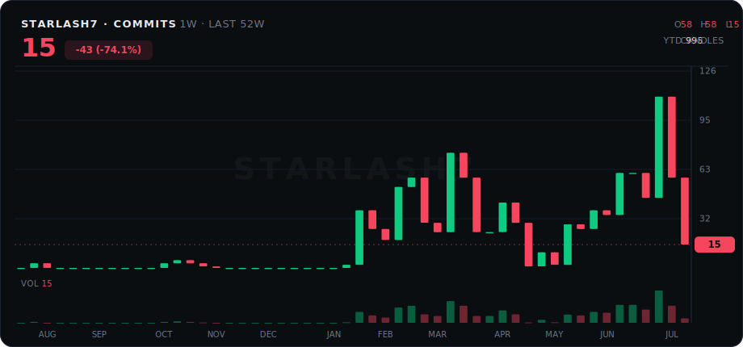
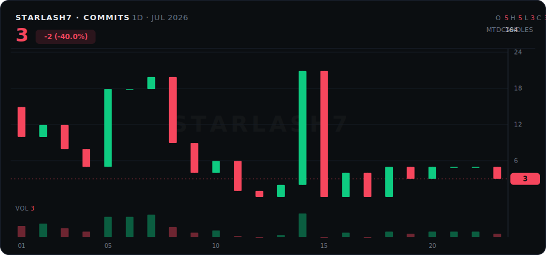

<div align="center">

# 🕯️ github-candles

**Your GitHub contributions, rendered as a trading chart.**

Every commit is a trade. Every week prints a candle. Green weeks you shipped, red weeks you didn't.



*52-week view — one candle per week, rolling year*



*Session view — one candle per day, resets monthly like a real trading session*

</div>

---

## How it reads

| Chart element | Meaning |
|---------------|---------|
| 🟢 Green candle | You committed more than the previous period |
| 🔴 Red candle | You committed less |
| Volume bars | Raw commit count |
| Last-price tag | Your latest period's commits |
| `YTD` / `MTD` | Total contributions in range |

Exchange-grade UI: OHLC readout, right-side price axis, last-price line, Binance-style palette. No stats cards. No trophies. Just price action.

## Quick start (2 minutes)

Works on your **profile repo** (`yourname/yourname`):

1. Copy two files into your profile repo:
   - [`generate_chart.py`](generate_chart.py)
   - [`.github/workflows/chart.yml`](.github/workflows/chart.yml)
2. Add to your `README.md`:
   ```html
   
   
   ```
3. Repo **Settings → Actions → General → Workflow permissions** → check **Read and write permissions**
4. **Actions → github candles → Run workflow** once.

Done. It self-updates daily on the default `GITHUB_TOKEN` — no PAT, no config. The workflow auto-detects the repo owner.

## Configuration

| Option | Where | Values |
|--------|-------|--------|
| `MODE` | env in `chart.yml` | `year` (52 weekly candles) / `month` (daily, resets on the 1st) |
| `OUT` | env in `chart.yml` | output filename |
| Update time | `cron` in `chart.yml` | default `0 15 * * *` = 00:00 KST |
| Colors | constants in `generate_chart.py` | `GREEN` / `RED` / `BG` etc. |

Run both modes in one job (the default workflow already does):

```yaml
run: |
  MODE=year  OUT=chart-year.svg  python generate_chart.py
  MODE=month OUT=chart-month.svg python generate_chart.py
```

## How it works

One Python file, stdlib only — no dependencies. It queries the GitHub GraphQL contributions API with the built-in Actions token, buckets days into weekly or daily candles (open = previous period's count, close = current), and writes a hand-rolled SVG. The chart is just text.

## FAQ

**Why is my chart mostly red?**
That's on you.

**Private contributions?**
The default token sees what your profile shows. Enable "Private contributions" in your GitHub profile settings if you want them counted.

**Can I use it outside the profile repo?**
Yes — set `GH_USER` env to any username.

## License

MIT — do whatever.
